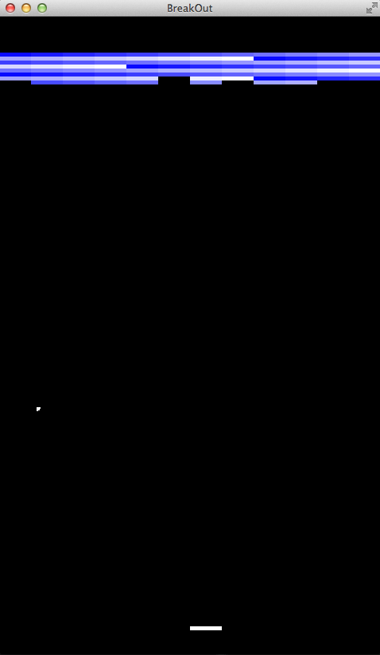

A Lousy BreakOut Clone
----------------------
My first game, programed with Java and the wonderful library: LibGDX. Took me a week to work out the game logic and countless nights of googling. Yup, I am that newbish and lousy with programming logic.

Here's the desktop playable version: [Breakout](Breakout-Desktop.jar).

### Controls
'R' to reset
left/right to move the paddle.

It is that simple. duh.

### Issues
- Ball goes crazy on collision with wall, paddle and blocks---randomly
- No game over as I was just focusing on the game logic, so, ball bounces off the bottom screen.
- it sucks. :D

_crazyhendrix_
